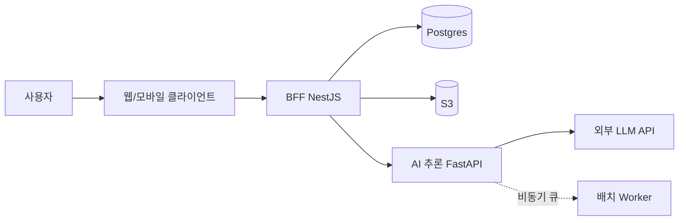
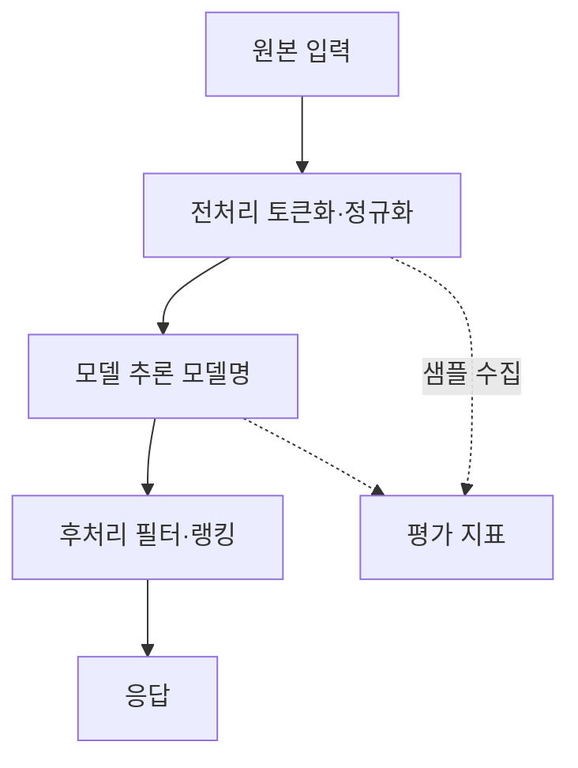
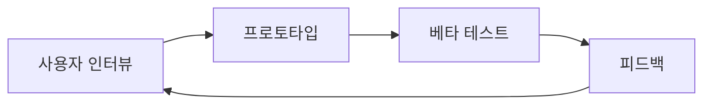
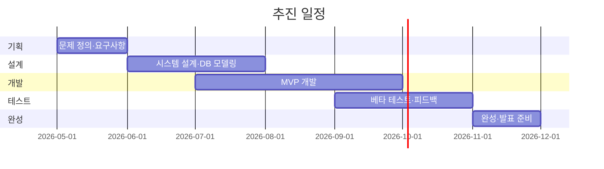

# image-suggestions — 섹션별 추천 시각 자료

> 본 skill은 그림을 직접 생성하지 않는다. 본문에 **placeholder + 제작 가이드**만 적고, 실제 제작은 사용자가 도구(Excalidraw / Figma / draw.io 등)로 한다.

양식의 모든 표(주요 기능 표, 개발환경 표, 추진 일정 표, 기대효과 표 등)는 본 skill이 직접 채운다. 본 파일은 표가 아닌 **이미지·다이어그램·차트**만 다룬다.

## 시각 자료가 가치 있는 섹션

| 섹션 | 권장 시각 자료 | 가치 |
| --- | --- | --- |
| 문제인식 | 사용자 인터뷰 인용 카드 3~5장 **또는** 정량 수치 그래프 | "사용자가 실제로 이 문제를 겪고 있음" 증거. 외부 후기 ⭐. |
| 시장분석 | 시장 규모 추이 그래프 (3~5년) | 정량적 시장 근거. 본문 비교표는 표로 들어감. |
| 시스템 구성도 | **컴포넌트 다이어그램** (필수) | 양식이 명시적으로 요구. |
| AI 활용 전략 | 데이터 플로우 다이어그램 (입력 → 전처리 → 모델 → 후처리 → 출력) | AI가 단순 wrapping이 아님을 시각으로 증명. |
| 수행 방법 | 사용자 검증 사이클 (인터뷰 → 프로토타입 → 피드백 → 반복) | 옵션. 외부 후기에서 사용자 검증 트레이스가 강조됨. |
| 결과물 형태 | **와이어프레임 또는 목업 스크린 1~3장** | "이런 모습으로 나옵니다"가 가장 강한 신호. 외부 후기 ⭐. |

## 권장 도구

| 용도 | 1순위 | 2순위 |
| --- | --- | --- |
| 시스템 구성도 / 컴포넌트 다이어그램 | **Excalidraw** (손그림 톤, 빠르고 신뢰감) | draw.io |
| 데이터 플로우 / 시퀀스 | Excalidraw | Figma |
| 와이어프레임 / 목업 스크린 | **Figma** | Sketch / Adobe XD |
| 막대·선 그래프 (시장 규모 등) | Google Sheets 차트 → PNG export | Canva |
| 인터뷰 인용 카드 | Figma 또는 **Canva** | — |
| 간트 차트 (양식 표로 충분하지만 시각화하고 싶을 때) | TeamGantt 또는 Mermaid `gantt` | Excel |

## placeholder 표준 포맷

본 skill이 본문에 적는 placeholder는 다음 모양을 따른다.

```
[<시각 자료 종류> — 권장: <도구>.
  포함 요소: <노드/항목/축>.
  스타일: <색·선·강조 가이드>.
  최종 파일: assets/<filename>.png — 1200px 이상 권장.]
```

### 예시

**시스템 구성도:**
```
[시스템 구성도 — 권장: Excalidraw.
  포함 요소: 클라이언트(웹/모바일), BFF(NestJS), AI 추론 서버(FastAPI), Postgres, S3, 외부 LLM API.
  스타일: 동기 호출 = 검은 화살표, 비동기 큐 = 점선, AI 경로는 보라색 강조.
  최종 파일: assets/system-diagram.png — 1200px 이상.]
```

**AI 데이터 플로우:**
```
[AI 데이터 플로우 — 권장: Excalidraw.
  포함 단계: (1) 원본 입력 → (2) 전처리(토큰화·정규화) → (3) 모델 추론 → (4) 후처리(필터·랭킹) → (5) 응답.
  각 단계 아래에 사용 모델·라이브러리 명시 (예: 3단계 = Claude Haiku 4.5 / 1024 토큰).
  최종 파일: assets/ai-flow.png — 1200px 이상.]
```

**와이어프레임:**
```
[와이어프레임 (MVP 3화면) — 권장: Figma.
  포함 화면: (1) 홈 / 검색 (2) 결과 리스트 (3) 상세 + AI 추천.
  요소: 헤더, 검색바, 결과 카드, AI 추천 영역(보라색 강조), CTA 버튼.
  최종 파일: assets/wireframe-{home,list,detail}.png — 각 1200px 이상.]
```

**인터뷰 인용 카드:**
```
[사용자 인터뷰 인용 카드 — 권장: Canva.
  포함: 응답자 3명, 각 카드에 인용 한 문장 + 인적 메타(연령대·직군·익명코드 P1/P2/P3).
  마스킹: 실명 X. P1·P2·P3 코드만.
  최종 파일: assets/interview-quotes.png — 1200px 이상.]
```

## 외부 후기에서 강조된 시각 자료 패턴

- **사용자 인터뷰 영상**은 SWM 발표 단골. 영상 제작이 부담이면 **인용 카드 3~5장**으로 대체 가능. 단 익명화 필수.
- **시스템 구성도가 너무 단순**(박스 3개, 화살표 2개)이면 신뢰도 하락. 데이터 플로우 + 외부 의존성 + 인증 흐름을 한 다이어그램에 표현.
- **와이어프레임 1장**은 발표 무게감을 크게 올림. MVP가 9월에 가능하면 9월 와이어프레임을 미리 보여주는 방식.
- **간트 차트는 옵션**. 양식 표만으로도 충분히 통과한 사례가 많음. 시각화에 시간 쓰지 말고 본문 다듬는 게 ROI 높음.

## 섹션별 Mermaid 권장 패턴

본 skill은 시각 자료 권장 섹션에 도달하면 **Mermaid 초안 + placeholder 제작 가이드**를 함께 본문에 삽입한다. Mermaid 초안은 RAW DATA에서 추출 가능한 노드·관계를 기반으로 사용자 프로젝트에 맞춰 채운다. 아래 패턴을 출발점으로 사용.

### 시스템 구성도 — `flowchart LR`



- 노드는 5~8개로 제한. 더 많으면 가독성 하락.
- AI 경로는 따로 클래스로 묶는 패턴 권장: `classDef ai fill:#eee,stroke:#a06;`.

### AI 데이터 플로우 — `flowchart TD`



- 평가 지표 노드를 점선으로 표시. 외부 후기에서 "AI는 평가 지표가 같이 보여야 강하다"가 자주 등장.

### 사용자 검증 사이클 — `flowchart LR`



### 추진 일정 — `gantt` (옵션)



- 양식 표와 중복되므로 옵션. 발표 PPT용으로 따로 빼고 싶을 때만 본문에도 추가.

## 본 skill 호출 시 동작 (디폴트)

해당 섹션에 도달하면 본문에 **Mermaid 초안 + placeholder 제작 가이드**를 동시에 적는다. 사용자가 답변하기 전 디폴트 상태에서는 둘 다 그대로 본문에 남는다.

| 사용자 답변 | 동작 |
| --- | --- |
| "Mermaid로 충분" / "이걸로 가자" | placeholder 가이드 블록을 인라인 추가논의로 옮기고 본문에는 Mermaid만 남김. |
| "직접 그릴게" / "Excalidraw로 따로" | Mermaid 블록 삭제. placeholder만 유지. 인라인 추가논의에 `#DD-N [디자인 결정] OOO 그림 제작 담당·일정 미정` 누적. |
| "Mermaid 일부 수정" | 본문의 Mermaid 코드 그대로 수정 반영. placeholder도 같이 유지. |
| 답 없음 / "일단 그대로" | 둘 다 그대로 유지. 다음 섹션 진행. |

### Mermaid 사용 시 주의 (마무리 출력에 포함)

- PDF 변환 단계에서 Mermaid 코드 블록이 그대로 텍스트로 박힐 위험. 최종 제출 전에는 GitHub / Notion / Mermaid Live Editor 등으로 렌더링 → PNG export → 본문 이미지 교체 권장.
- 노드 5~8개 제한. 더 복잡한 다이어그램은 Excalidraw / draw.io로 다시 그리는 편이 가독성 ↑.
- 본 skill은 종료 메시지에서 "Mermaid 블록은 이미지로 교체"를 표준 안내로 포함한다.
