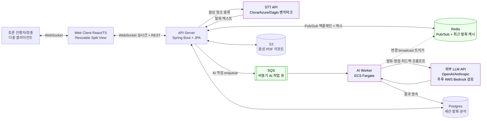
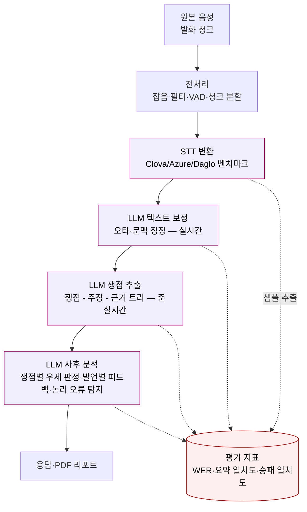

# 2026년도 AI·SW마에스트로 제17기 프로젝트 기획서

<!--
분량 : 10p 이내 작성
분담 모드: 섹션 6~9만 채움. 1~5·10~11은 다른 팀원 분담으로 비워둠.
-->

---

## 목적 및 필요성

### 문제인식

토론은 발화 즉시 휘발되어 복기·평가·산출물 작성을 어렵게 만든다. 본 팀은 2026-04-23 보고서·교사 50분 인터뷰·2026-05-08·05-09 유저 인터뷰를 통해 사용자 세그먼트별로 다음 3가지 페인 포인트가 반복적으로 관측됨을 확인했다.

**1) 토론자 — 발언 복기 자료 부재로 실력 향상이 막힌다.** 유저 인터뷰(2026-05-08·05-09)에서 토론자는 토론 중 키워드 위주 손 메모만 가능하며, 토론 종료 후 본인 발언 내용을 재구성하기 어렵다고 응답했다. "키워드 위주로 적느라 정작 토론 흐름은 놓친다", "낙서 같은 메모는 기념품 그 이상의 의미를 갖지 못한다"는 응답이 공통으로 나왔다.

**2) 청중·판정관 — 흐름 파악과 판정의 객관성 확보가 어렵다.** 박OO(2023, 경인교대) 학위 논문 "대립 토론 수업을 활용한 과정 중심 평가 실행연구"는 짧은 시간에 다수의 발화가 지나가는 토론에서 판정관·청중이 토론 흐름을 따라잡기 어렵다는 점을 지적한다. 도메인 차원에서도 오산시 토론대회의 판정 근거 시말서 제출 의무, 중학교 토론대회의 판정 불복 사례 등 판정 객관성 이슈가 반복된다.

**3) 교사·동아리 회장 — 산출물(생기부 세특·홍보 카드뉴스) 작성 부담이 크다.** 교사 50분 인터뷰에서 외부 세특 업체가 "토론 캠프 참여하여 자기 주장 펼침" 수준으로만 작성해 학교가 업체를 교체한 사례, 30명 규모 토론 수업에서 모든 학생의 수행 정도를 트래킹하기 어렵다는 응답이 확인되었다. 동아리 회장 인터뷰(2026-05-08)에서는 토론 활동 내역을 객관적으로 정리·아카이빙하는 도구가 부재하다는 응답이 나왔다.

**기존 시스템의 한계.** 기존 회의록 도구(클로바노트 등 범용 STT 요약)는 토론 도메인의 **쟁점-주장-근거 3단 구조**를 추출하지 못하고, 화자 분리·찬반 라벨링·논리적 오류 탐지 등 토론 특화 기능이 부재하여 위 페인 포인트를 해결하지 못한다.

[근거 시각화 placeholder — 권장: Canva 인터뷰 인용 카드.
  포함: 응답자 3명(P1 동아리 회장 / P2 토론자 / P3 토론 강사), 각 카드에 인용 한 문장 + 인적 메타(연령대·역할·익명코드).
  마스킹: 실명 X.
  최종 파일: assets/interview-quotes.png — 1200px 이상.]

<!--
⚠ 이 섹션 추가 논의 필요 사항
- #DD-19 [근거 부족] "국내 토론 동아리 N개 / 토론자 NNN명 규모"의 정량 수치는 RAW에 1차 출처 미확보. KOSIS·교육부 학교생활기록부 통계·대학 동아리 연합 통계 등에서 인용 가능한 1차 출처 확보 후 본문에 추가하면 외부 후기에서 자주 지적되는 "정량 수치 근거" 항목 충족.
- #DD-20 [확인 필요] 박OO(2023) 학위 논문 인용은 RAW에 기재된 인용을 그대로 옮긴 것. 원문 확인 후 정확한 인용 형식·페이지·DOI 보강 필요.
-->

### 기획의도

본 프로젝트는 위 페인 포인트의 공통 원인을 **"토론 흐름이 구조화되지 않은 채로 휘발되는 것"** 으로 정의하고, 자동화된 실시간 속기·요약·분석 도구로 이를 해결한다. 황OO 멘토(종합·사각지대 멘토링) 코멘트("트래킹 관점에서 1차 구조화를 어떻게 보여줄 것인가가 가치")를 반영하여, 1차 산출물은 **트래킹(=실시간 속기 + 쟁점 요약)** 에 집중하고 그 위에 평가·산출물(세특·카드뉴스 등)을 2차로 쌓는다.

**팀의 의사 결정 축**

- **기술 도전 영역**: 실시간성 기술(WebSocket·세션 동기화·다중 viewer broadcast·재접속 복구·LLM 보정 파이프라인)을 코어로 두어 백엔드·프론트엔드 모두 면접에서 깊이 있게 설명 가능한 기술 자산을 확보한다.
- **타겟 절단**: 미성년자 녹음 동의·교육 도메인 규제 이슈를 회피하기 위해 1차 타겟을 **대학 토론 동아리**로 한정한다. 동아리는 2주 간격 데모·피드백 사이클이 가능한 유저풀이며, 콜리의 기존 DT(Debate Timer) 운영 경험으로 컨택 라인을 확보하고 있다.
- **버티컬 커머스 전략**: "기능으로 차별화하지 않고 타겟으로 차별화한다"는 원칙으로 범용 회의록 도구(클로바노트 등) 대비 토론 도메인 특화 가치를 확보한다.

**6개월 안에 풀 수 있는 크기인 근거**

이OO 멘토(FE 기술 멘토링) 코멘트("기능당 2주면 충분, 블랙박스는 멘토가 잡아준다")와 5/12 회의 Sprint 0~4 일정에 따라 5월~11월 6개월간 (1) 메인 대시보드 (2) 팀별 사후 분석 (3) 개인별 사후 분석의 3단계 점진 도입이 가능하다. 9월 중간평가 시연 단위는 메인 대시보드 1개로 보수적으로 마감을 보장하고, 사후 분석은 도달 시 가산하는 형태로 일정 리스크를 통제한다.

<!--
⚠ 이 섹션 추가 논의 필요 사항
- #DD-21 [확인 필요] 본문 "콜리의 기존 DT 운영 경험으로 컨택 라인 확보"는 RAW 표현 그대로. DT 사용자 규모·기존 동아리 컨택 이력 수치 보강 시 신뢰도 ↑.
-->

---

## 프로젝트 개요

### 프로젝트 소개

본 프로젝트는 (가칭) **DebateZip** — 대학 토론 동아리를 1차 타겟으로 하는 실시간 토론 속기·요약·분석 SaaS다. 토론 음성을 실시간으로 텍스트화하고 LLM 기반으로 **쟁점-주장-근거 3단 트리** 를 추출해, 토론 도중에는 흐름 파악을, 토론 종료 후에는 팀별·개인별 사후 분석과 PDF 리포트를 제공한다.

**한 줄 정의**

> "휘발되는 토론을 구조화된 기록·분석으로 남기는 실시간 토론 SaaS"

**서비스 형태·접근 채널**

- **형태**: 웹 기반 SaaS(반응형 웹).
- **접근**: 토론 세션 호스트가 서비스에 로그인 후 새 세션을 개설하고, 참여자·청중·판정관이 세션 링크로 접속해 동시에 화면을 본다.
- **사용 시나리오**: 대학 토론 동아리의 정기 세다(아카데미식) 토론 세션, 토론 강사가 학생 그룹 토론 수업을 진행할 때, 토론대회 예선·본선의 판정 보조 도구로 사용한다.

**1차 타겟 사용자 페르소나**

- **P1 — 대학 토론 동아리 회장(20대 초반)**: 매 토론 활동 내역을 인스타·카페 게시물·동아리 공식 기록으로 정리해야 하지만 수작업 부담이 크다. 동아리 회장 활동이 본인 이력에서 가장 우선순위 높은 자산이라 활동 아카이빙 도구를 필요로 한다(2026-05-08 인터뷰 응답).
- **P2 — 동아리 정규 토론자(20대 초반)**: 토론 중 키워드 메모만 가능해 사후 복기가 어렵다. 발언별 단위로 "잘한 점 + 아쉬운 점 + 보완 방법" 서술형 피드백을 받고 싶다(2026-05-08·05-09 인터뷰 공통).
- **P3 — 토론 강사·교사(30~40대)**: 학생 평가·생기부 세특 작성·수행평가 피드백을 효율화하고 싶다. 단, 점수·랭킹은 학생 부담을 키워 거부감이 있으므로 서술형 피드백이 우선이다(2026-05-09 인터뷰).

<!--
⚠ 이 섹션 추가 논의 필요 사항
- #DD-22 [팀 논의 필요] 서비스명 (가칭) "DebateZip"은 본 하네스가 디렉터리명·repo명에서 추론한 표기. 4/23 보고서에는 (가칭) "Discourse" 표기도 있음. 팀 합의 서비스명·한 줄 카피 확정 필요(요약본 작성 시 필수).
- #DD-23 [팀 논의 필요] 페르소나 3종(P1·P2·P3)을 구체 페르소나 카드(이름·연령·일과·도구)로 별첨할지 본문 텍스트로만 두는지 결정. 외부 후기에서 자주 지적되는 항목이라 카드 별첨 시 평가 ↑.
-->

### 주요 기능

| 기능 | 설명 |
|------|------|
| **주요 기능1 — 실시간 토론 속기·쟁점 요약 (메인 대시보드)** | 토론 음성을 실시간 STT로 텍스트화하고 LLM이 화자별·찬반별로 발화를 분류한다. 동시에 누적 발화로부터 쟁점-주장-근거 3단 트리를 추출해 메인 대시보드에 split view로 표시한다. 다중 viewer가 동일 세션을 구독할 수 있고, 토론 중간에 합류한 사용자도 직전 발화 내역을 즉시 받아본다. |
| **주요 기능2 — 팀별 사후 분석 (쟁점별 우세 판정 + 종합 설득력 점수)** | 토론 종료 시 전체 발화·쟁점 트리를 입력으로 LLM이 쟁점별 우세 팀을 판정하고 그 근거 발화를 연결한다. 종합 설득력 점수와 시간대별 설득력 변화 그래프를 제공해 팀 단위 복기를 돕는다. |
| **주요 기능3 — 개인별 사후 분석 (발언별 피드백 + 논리적 오류 탐지)** | 참여자 개개인의 발언 단위로 "잘한 점 + 아쉬운 점 + 보완 방법" 서술형 피드백을 제공한다. 인신공격·허수아비 논법·성급한 일반화·흑백논리 등 토론 도메인 표준 논리 오류를 자동 탐지하고 개선 제안을 함께 보여준다. 개인별 PDF 리포트로도 내려받을 수 있다. |

기능 우선순위는 1번이 빠지면 서비스 자체가 성립하지 않고(STT·쟁점 트리가 모든 후속 기능의 입력), 2번·3번은 1번 위에 점진 도입되는 가산 가치다.

**MVP에서 제외/후순위로 둔 기능 (인터뷰 결론 반영)**

- 실시간 승리 확률 — 신뢰도·실질 가치 낮다는 응답이 2026-05-08·05-09 인터뷰 모두에서 공통.
- 근거 유형 분포(통계/사례/전문가 인용/논리 추론) — 활용 가치 낮음.
- 개인 종합 점수·랭킹 — 부원 심리적 부담 큼, 서술형 피드백으로 대체.

<!--
⚠ 이 섹션 추가 논의 필요 사항
- #DD-24 [팀 논의 필요] 본문 3대 기능 외 추후 도입 후보(카드뉴스 자동 생성·세특 초안 생성·PDF 리포트 커스터마이즈)는 후순위 분류. 평가에서 "확장성 보여주려면 명시"가 유리할 수도 있어 본문 노출 여부 결정 필요.
-->

### 시장분석

**시장 규모**

- **국내 대학 토론 동아리**: 약 **N개 동아리 / NNN명 규모** (KOSIS·대학 동아리 연합 통계 등 1차 출처 확보 후 정확 수치 반영 예정).
- **국내 중·고등 토론 수업·토론대회**: **NNN개 학교 / NNNN명 학생 규모** (교육부 학교생활기록부 통계 또는 한국토론교육협회 자료 확보 후 반영).
- **AI 토론 코칭 글로벌 시장 참조**: 아웃스쿨(Outschool)의 "Debate Coaching" 카테고리 누적 수강 약 150만 건 수준(2026-04 시점 자체 캡쳐 — 정확한 URL·시점 출처 보강 필요). 토론 코칭에 대한 글로벌 수요가 일정 규모 이상임을 시사한다.

**경쟁 서비스 비교**

| 구분 | 클로바노트 | Otter.ai | 본 서비스 (DebateZip) |
|------|-----------|---------|----------------------|
| 도메인 특화 | 범용 회의록 | 범용 회의록·강의 | **토론 전용** |
| 화자 분리 | 일반 화자 ID | 일반 화자 ID | **세다 토론 턴 구조 + 찬반 라벨링** |
| 쟁점 추출 | ✗ (단순 요약) | ✗ (단순 요약) | **쟁점-주장-근거 3단 트리** |
| 사후 분석 | 회의 요약 | 회의 요약·키워드 | **쟁점별 우세 판정 + 발언별 피드백 + 논리 오류 탐지** |
| 실시간 다중 viewer | △ | △ | **○ (WebSocket 브로드캐스트)** |
| 가격대 (개인 기준) | 무료~월 수천원대 | 무료~월 수만원대 (국제 카드 결제) | 미정 (1차 인터뷰: 동아리 월 5,000~10,000원 / 토론 강사 월 30,000~40,000원) |

> ⚠ 비교표의 클로바노트·Otter.ai 가격대·기능 항목은 본 하네스 작성 시점 일반 인식 수준 정보이며, 기획서 최종 제출 전 각 서비스 공식 페이지에서 최신 정보로 보강 필요.

**차별화 한 줄**

> "범용 회의록 도구는 회의 내용을 텍스트화할 뿐이지만, 본 서비스는 토론의 논증 구조 자체를 LLM으로 구조화한다."

**프로젝트 개발 타당성**

- **수요 측 — WTP 1차 확인**: 1차 인터뷰에서 동아리는 월 5,000~10,000원, 토론 강사는 월 30,000~40,000원의 지불 의사 응답.
- **공급 측 — 기술 가능성**: 실시간 STT·LLM 텍스트 보정·쟁점 추출은 외부 API 조합으로 MVP 가능. 도메인 특화 가치는 프롬프트·평가 데이터셋 단에서 확보.
- **확장 경로**: 동아리 검증 → 토론 강사·학원 → 학교 교사·세특 → 토론대회 운영진의 순차 확장 가능. 각 단계의 지불 의향이 1차 인터뷰에서 확인됨.

[시장 규모 시각화 placeholder — 권장: Google Sheets 차트 → PNG export.
  포함 요소: 국내 대학 토론 동아리 수·인원·지역별 분포, 토론 수업 도입 학교 수 3~5년 추이.
  스타일: 막대 차트 또는 누적 영역 차트. 출처는 차트 하단에 명시.
  최종 파일: assets/market-size.png — 1200px 이상.]

<!--
⚠ 이 섹션 추가 논의 필요 사항
- #DD-25 [근거 부족] 국내 대학 토론 동아리 수·인원 1차 출처 미확보. KOSIS·교육부·대학별 동아리 연합 통계 확인 후 "N개 NNN명" placeholder를 정확 수치로 교체.
- #DD-26 [근거 부족] 국내 토론대회·중고등 토론 수업 학교 수·학생 수 1차 출처 미확보. 교육부 학교생활기록부 통계 또는 한국토론교육협회 자료 확인 필요.
- #DD-27 [확인 필요] 경쟁 서비스 비교표의 클로바노트·Otter.ai 가격대·기능은 본 하네스 작성 시점 일반 인식. 각 서비스 공식 페이지에서 최신 정보로 보강 필요.
- #DD-28 [확인 필요] 아웃스쿨 "Debate Coaching" 누적 수강 약 150만 건 수치는 RAW에 캡쳐 이미지만 있음. 정확한 URL·시점 표기 보강 필요.
-->

### 시스템 구성도

본 프로젝트는 실시간 토론 음성을 입력으로 받아 STT·LLM 파이프라인을 거쳐 속기록·쟁점 분석·개인별 피드백을 산출하는 SaaS 구조다. **STT 처리는 백엔드(BFF)가 일괄 중계**하여 다중 클라이언트로의 브로드캐스트와 영속 저장을 모두 백엔드가 책임진다. 이 구조는 토론 중간에 합류한 사용자에게도 직전까지의 발화 내역을 동일하게 제공하며, 토론 종료 후 사후 분석에도 동일한 영속 데이터를 재사용한다. **다중 viewer 동시 구독은 Redis Pub/Sub 백플레인으로**, **LLM 호출은 SQS 비동기 워커로** 분리하여 BFF의 실시간 WebSocket 흐름이 AI 응답 지연에 막히지 않도록 한다. AI 추론은 1차로 외부 LLM API(OpenAI / Anthropic 등)를 사용하고, 품질·비용·기술 도전 측면에서 필요해지는 시점에 AWS Bedrock 도입을 검토한다.

[시스템 구성도 — 권장: Excalidraw.
  포함 요소: 다중 Web Client, Spring BFF, Redis(Pub/Sub + 캐시), STT 외부 API(Clova/Azure/Daglo 중 1), SQS, AI Worker(ECS Fargate), 외부 LLM API(OpenAI/Anthropic), Postgres, S3.
  스타일: WebSocket 양방향 = 굵은 선, 동기 REST = 검정 화살표, AI 경로(STT·LLM·Worker) = 보라색, 인프라(Redis·SQS) = 녹색, 비동기 큐 흐름 = 점선.
  최종 파일: assets/system-diagram.png — 1200px 이상.]

**핵심 데이터 흐름**

1. **세션 시작.** 클라이언트가 BFF에 토론 세션을 생성하고 WebSocket 연결을 수립한다. BFF는 해당 세션의 Redis Pub/Sub 토픽을 구독한다.
2. **발화 입력.** 클라이언트가 음성 청크를 BFF로 전송 → BFF가 STT API에 중계 → 변환된 발화 텍스트를 Postgres에 INSERT → Redis Pub/Sub로 발행 → 동일 세션을 구독 중인 모든 BFF 인스턴스가 WebSocket으로 자신의 클라이언트에 broadcast 한다.
3. **실시간 텍스트 보정.** BFF가 발화 INSERT 직후 SQS에 "보정 작업"을 enqueue → AI Worker가 LLM 호출 → 보정 결과로 발화 레코드 UPDATE → Redis Pub/Sub로 변경 broadcast.
4. **쟁점 요약.** 일정 분량의 발화가 누적되면 BFF가 SQS에 "쟁점 추출 작업"을 enqueue → AI Worker가 LLM 호출 → 결과를 Postgres에 저장하고 broadcast 한다.
5. **사후 분석.** 토론 종료 시 BFF가 쟁점별 우세 판정·발언별 피드백·논리적 오류 탐지 작업을 SQS에 일괄 enqueue → AI Worker가 LLM 호출 → 결과를 Postgres·S3에 저장한다. 사용자는 PDF 리포트로 다운로드 가능하다.

**Sprint별 도입 단계 (점진 도입)**

- **Sprint 1-1**: Postgres + 단일 BFF 인스턴스 + WebSocket 메모리 브로드캐스트로 메인 대시보드(실시간 속기록 + 쟁점 요약) 동작 확보.
- **Sprint 1-2**: Redis Pub/Sub 백플레인 + 최근 발화 캐시 도입. 다중 viewer·중간 합류 유저 시나리오 안정화.
- **Sprint 2 이상**: SQS + AI Worker 도입. 사후 분석(팀별·개인별)에 비동기 큐 적용. 워커 실패 시 DLQ로 격리.

<!--
⚠ 이 섹션 추가 논의 필요 사항
- #DD-1 [팀 논의 필요] DB·캐시·메시지큐 구성. 본문은 강력 추천안인 C안(Postgres + Redis + SQS)으로 초안 박음. 본 결정 보류 시 아래 5개 안 중 택1 후 본문/시스템 구성도 갱신 필요.
  - A안 (Postgres only): 구성 가장 단순, 운영 부담 0, Spring Data JPA 친화. 단점: 발화 INSERT·보정 UPDATE 동시성 락 이슈, 단일 BFF 인스턴스에 묶여 수평 확장 불가, 신입 BE 면접 카드 약함.
  - B안 (Postgres + Redis): 수평 확장 가능, 중간 합류 유저 응답 빠름, ElastiCache로 AWS 친화. 단점: 캐시 미스·일관성 처리 코드 필요, AI 동기 호출 시 BFF 응답 지연 + WebSocket 흐름 막힘 문제 미해결.
  - C안 (Postgres + Redis + SQS) ★강력 추천★: 실시간 브로드캐스트(Redis Pub/Sub) + AI 비동기 워커 분리(SQS). 면접 카드 2종 동시 확보(WebSocket 수평 확장 + AI 큐 분리), AWS 친화로 멘토 "AWS 정상픽" 부합, Sprint 1-1→1-2→2의 점진 도입 가능. 단점: Worker 디플로이(ECS Fargate 1 task 수준), DLQ·메시지 재시도 설계 학습 필요.
  - D안 (Postgres + Kafka 이벤트 소싱·CQRS): 이벤트 소싱 면접 카드 최강. 단점: 3개월 MVP에 운영 부담 과함(MSK·브로커·Zookeeper), 멘토 "힙스터 픽 피하자" 정면 충돌, peer-competitor 관점 "써본 적 없는데 쓴 척" 진정성 의심. 권장 안 함.
  - E안 (Postgres + Redis + WebSocket STOMP 브로커): Spring WebSocket STOMP + Redis Backplane으로 수평 확장. 단점: STOMP 학습 곡선, B안 대비 신규 면접 카드는 STOMP 한 장뿐, AI 비동기 호출 문제는 별도로 해결해야 함.
  - 결정 축: ① 3개월 안에 백엔드 1명(커찬)이 완성 가능한가, ② 신입 BE 면접에서 30분 떠들 카드를 만드는가, ③ 실시간 STT 다중 viewer + LLM 사후 분석 도메인에 자연스러운가, ④ 멘토 "AWS 정상픽 / 힙스터 픽 피하자 / 면접관이 했던 것을 해야 한다" 코멘트와 부합하는가.
- #DD-2 [팀 논의 필요] STT 벤더(Clova / Azure / Daglo / Whisper) 확정 미정. 벤치마크 진행 중. 결과 나오면 본문 "STT 외부 API"를 실제 벤더 이름으로 교체.
- #DD-3 [팀 논의 필요] LLM 1차 벤더(OpenAI / Anthropic 등) 확정 미정. 비용·한국어 품질·레이턴시 비교 결과에 따라 본문에 명시할 벤더 결정.
- #DD-4 [디자인 결정] 시스템 구성도 최종 PNG는 Excalidraw로 제작 예정. 담당·일정 미정.
-->

### 개발환경

본 프로젝트의 기술 스택은 (1) 면접관 친화 스택 우선(이OO 멘토 코멘트), (2) 실시간성 기술을 팀의 공통 새 도전 영역으로 두고 깊이 있게 다룰 것, (3) AWS 정상 인프라 활용 — 세 가지 원칙으로 선정되었다.

| 구 분 | 항 목 | 세부 내용 |
|------|------|---------|
| **SW 개발환경** | OS | 개발: macOS / Windows 11 · 배포: Linux (AWS EC2 또는 ECS Fargate) |
| | 개발도구 | IDE: IntelliJ IDEA(BE), VS Code / Cursor(FE) · 협업: GitHub Org `KFC-SOMA-17`, Notion(스프린트·회고·문서), Discord(데일리 스크럼·정기 회의), Figma(디자인·와이어프레임) · 형상관리: GitHub Flow + PR 리뷰 · CI/CD: GitHub Actions |
| | 개발언어 | Backend: Java 17 + Spring Boot 3 + Spring Data JPA · Frontend: TypeScript + React · (추후 AWS Bedrock 도입 시) AI Worker: Python |
| | 실시간 통신 | 1차안: WebSocket (Spring WebSocket 기반) — 다중 클라이언트 양방향 발화 broadcast 및 분석 결과 실시간 갱신 |
| | 데이터 | RDB: PostgreSQL · 캐시·Pub/Sub: Redis · 메시지 큐: AWS SQS (Sprint 2+ 도입) · 파일 스토리지: AWS S3 |
| **AI 활용환경** | 사용모델 | **1차(MVP)**: 외부 LLM API(OpenAI / Anthropic Claude 중 비용·한국어 품질·레이턴시 벤치마크 후 선정). **추후 도입 검토**: AWS Bedrock. **STT**: Clova Speech / Azure Speech / Daglo / Whisper 중 벤치마크 후 선정 |
| | 활용방식 | (1) STT 실시간 음성→텍스트 변환(BFF 중계) (2) LLM 기반 STT 결과 오타·문맥 보정(메인 화면 실시간 반영) (3) LLM 기반 쟁점 추출·요약(준실시간) (4) LLM 기반 사후 분석: 쟁점별 우세 판정 / 발언별 피드백 / 논리적 오류 탐지 — MVP는 BFF(Java)에서 LLM API 직접 호출, Sprint 2+에서 SQS + AI Worker로 분리 도입 예정 |
| **기타** | 인프라 | AWS (EC2 또는 ECS Fargate, RDS Postgres, ElastiCache Redis, SQS, S3) |
| | 모니터링·관측 | Grafana + Prometheus (메트릭 수집·대시보드) + NAVER Pinpoint (APM·분산 트레이싱) |
| | 팀의 새 도전 영역 | **3인 공통**: "실시간성"을 코어로 다루는 첫 프로젝트. WebSocket 기반 세션 동기화·다중 viewer broadcast·재접속 복구·동시성 제어를 BE·FE 모두 정면으로 다룬다. |

<!--
⚠ 이 섹션 추가 논의 필요 사항
- #DD-5 [팀 논의 필요] 실시간 통신 프로토콜. 1차안 WebSocket으로 본문 박았으나, WebRTC(P2P 음성 스트리밍 + 데이터 채널), SSE(서버→클라이언트 단방향), gRPC Streaming 등 대안 검토 여지 있음. 음성 채널·메타데이터 채널 분리 여부에 따라 선택이 달라짐.
- #DD-6 [팀 논의 필요] AI Worker 언어. MVP에선 BFF(Java)에서 LLM API 직접 호출. AWS Bedrock 도입 시점에 Worker를 Python으로 신설할 가능성. 도입 시점·담당·런타임(ECS Fargate / Lambda) 미정.
- #DD-7 [팀 논의 필요] CI/CD·테스트 전략 세부. GitHub Actions 가안만 박음. 단위·통합·E2E 분리, 커버리지 게이트, 배포 환경(dev/stg/prd) 분리 등 미정.
-->

### AI 활용 전략

본 프로젝트는 **AI가 서비스 가치의 코어**에 위치한다. 토론의 실시간 기록(STT) 자체가 AI 호출이며, 그 위에 쌓이는 모든 기능(쟁점 추출·우세 판정·발언별 피드백·논리적 오류 탐지)이 LLM 추론 결과를 1차 산출물로 사용한다. **AI를 제거하면 본 서비스는 성립하지 않는다.**

**1) AI 처리 파이프라인 (단계)**

[AI 데이터 플로우 — 권장: Excalidraw.
  포함 단계: (1) 음성 청크 (2) 전처리(VAD·잡음 필터) (3) STT 변환 (4) LLM 텍스트 보정 (5) LLM 쟁점 추출 (6) LLM 사후 분석 (7) 응답·PDF.
  각 단계 아래에 사용 모델·라이브러리 명시. 평가 지표 노드는 점선으로 별도 표시.
  최종 파일: assets/ai-flow.png — 1200px 이상.]

**2) 단계별 AI 호출 목적·모델 후보군**

기능별 요구 특성이 다르므로 **단일 모델이 아닌 단계별 모델 분리 전략**을 취한다. 가벼운 작업은 저비용·저레이턴시 모델, 고난도 분석은 고품질 모델을 사용한다.

| 단계 | 입력 | 출력 | 모델 후보군 | 평가 지표 |
|------|------|------|------------|----------|
| STT 변환 | 음성 청크 | 발화 텍스트 + 화자ID | Clova Speech · Azure Speech · Daglo · Whisper | WER (Word Error Rate) |
| LLM 텍스트 보정 (실시간) | STT 원문 + 직전 발화 컨텍스트 | 오타·문맥 정정된 발화 | **저비용·저레이턴시 모델군**: GPT-4o-mini · Claude Haiku · Gemini Flash 등 | 사람 보정본과의 BLEU · 편집거리 |
| LLM 쟁점 추출 (준실시간) | 누적 발화 청크 | 쟁점-주장-근거 트리 | **고품질 모델군**: GPT-4o · Claude Sonnet · Gemini Pro 등 | 사람 정답셋과의 쟁점 일치율 |
| LLM 사후 분석 (비실시간) | 전체 발화 + 쟁점 트리 | 쟁점별 우세 판정 · 발언별 피드백 · 논리 오류 라벨 | **고품질 모델군**: GPT-4o · Claude Sonnet · Gemini Pro 등 | 토론 대회 실제 결과와 승패 일치도 |

**모델 선택 기준 (개발 착수 전 자체 벤치마크로 확정 예정)**

- **응답 속도(레이턴시)**: 실시간 보정은 발화 직후 1~2초 내 응답이 필수, 사후 분석은 분 단위 허용.
- **한국어 품질**: 토론 도메인 전문 용어·논증 구조 처리 정확도. 자체 평가 셋(아래 항목 4)으로 측정.
- **호출당 비용**: 토큰당 단가 × 토론 1회당 누적 호출 횟수. 토론 1회(40~50분, ~6,000자 가정) 기준 예상 비용 산정.
- **컨텍스트 길이**: 사후 분석은 토론 전체(40~50분 분량)를 단일 컨텍스트로 입력 가능한 모델이어야 함.
- **API 안정성**: 한국 IP 기준 가용성·rate limit 정책·SLA.

추후 AWS Bedrock 도입 시 동일 기준으로 Bedrock 카탈로그 내 모델(Claude on Bedrock · Llama on Bedrock 등)을 재평가한다.

**3) 도메인 특화 차별화 (단순 LLM 래퍼가 아닌 이유)**

- **세다 토론(아카데미식) 도메인 지식 주입**: 찬성1→반대1→찬성2→반대2 식 턴 구조를 시스템 프롬프트에 명시하여 화자 분리·역할 라벨링 정확도를 높인다. 자유 토론 대비 도메인 가정이 정확해진다.
- **쟁점-주장-근거 3단 트리 구조 강제 추출**: 일반 회의록 요약(클로바노트 등)이 만들지 못하는 토론 도메인 고유의 논증 구조를 LLM 프롬프트로 강제한다.
- **논리적 오류 탐지의 분류 체계**: 1차 분류표로 **인신공격 · 허수아비 논법 · 성급한 일반화 · 흑백논리** 4종을 사용한다. 토론자·청중에게 "맞다/틀리다 영역으로 받아들여져 피드백이 가장 강하게 와닿는다"는 유저 인터뷰(5/9 토론 강사 인터뷰) 결과를 반영했다. **개발 착수 전 멘토·도메인 전문가 검토로 분류표를 보강할 예정이다.**

**4) AI 품질 측정 전략 (멘토 피드백 반영)**

황OO 멘토 피드백("실제 토론 10+개에 대해 사람 정답셋 확보 → LLM 결과와 비교 → LLM judge로 평가")과 이OO 멘토 피드백("A4 반장 분량 고정 텍스트로 STT 정확도 50% 목표부터 시작 → 고도화")을 결합한 2단 평가 체계를 구축한다.

- **평가용 데이터셋 확보 경로**: 유튜브에 공개된 토론 대회 영상(약 10편 이상)을 후보로 수집하고, 팀이 직접 사람 요약본·쟁점 정답셋·승패 판정 정답셋을 작성하여 평가 기준셋을 구축한다. 별도의 동의 절차나 비용 부담 없이 시작 가능한 경로다.
- **단계 1 — 단위 정확도**: STT는 고정 텍스트 낭독 샘플의 WER, LLM 보정은 BLEU·편집거리, 쟁점 추출은 사람 정답셋과의 일치율로 측정.
- **단계 2 — 도메인 효과**: 실제 토론 대회 영상에 대한 사후 분석 결과(쟁점별 우세 판정·발언별 피드백)와 실제 대회 판정 결과의 **승패 일치도**·**판정 근거 일치도**를 비교한다.

**5) 기대효과**

- 토론 1회당 사람이 수작업으로 1~2시간 걸리던 속기·요약·피드백 작성을 LLM 파이프라인으로 자동화한다.
- 토론자에게 발언별 단위로 "잘한 점 + 아쉬운 점 + 보완 방법"의 서술형 피드백을 제공한다(점수 없이 — 5/8·5/9 유저 인터뷰 결론).
- 청중·판정관에게는 쟁점별 우세 판정의 **근거 발화 연결**을 제공하여 주관 판정의 객관성을 보강한다.

<!--
⚠ 이 섹션 추가 논의 필요 사항
- #DD-8 [팀 논의 필요] 단계별 LLM 모델 최종 확정 미정. 본문에는 후보군(저비용/저레이턴시 vs 고품질)과 선택 기준(레이턴시·한국어 품질·비용·컨텍스트·API 안정성)만 박았음. 개발 착수 전 자체 벤치마크 실행 후 단계별로 1개씩 확정 필요.
- #DD-9 [멘토 확인] 논리적 오류 분류 체계는 1차 4종(인신공격·허수아비·성급한 일반화·흑백논리)으로 시작하되 개발 착수 전 토론 도메인 전문가·멘토(이상철·황연성·신기용) 코멘트로 보강 예정. 분류표 최종본은 시스템 프롬프트에 박혀야 함.
- #DD-10 [데이터 확보] 평가용 토론 대회 영상 후보 리스트(유튜브 URL) 수집·정답셋 작성 담당자·일정 미정. 분량 가정(영상 10편 × 사람 요약 1회) 기준 작업량 산정 필요.
- #DD-11 [디자인 결정] AI 데이터 플로우 다이어그램 최종 PNG는 Excalidraw 제작 예정. 담당·일정 미정.
-->

---

## 프로젝트 수행 방안

본 팀은 BE 2인·FE 1인의 3인 구성이며, 직무와 별개로 영역별 최종 의사결정권을 분리한 크로스 펑셔널 리더십 체제로 운영된다. 인터뷰·MVP·사후 분석·발표 준비를 11월까지 분기 단위 스프린트로 진행한다.

### 팀 구성 및 역할

| 구 분 | 담당 역할 |
|------|---------|
| **콜리 (김OO) — Backend / Product Lead** | 프로덕트·비즈니스 영역 최종 결정권자. 토론 도메인 지식·유저 인터뷰·STT 벤더 분석·동아리 컨택 주도. 백엔드 개발은 커찬과 공동 진행하며, 태스크 단위 분담은 매 스프린트 진행 중 논의로 결정한다. |
| **커찬 (이OO) — Backend / System Architecture Lead** | 시스템 아키텍처 영역 최종 결정권자. 실시간 통신(WebSocket)·동시성·AWS 인프라·CI/CD·기술 스택 선정 주도. 백엔드 개발은 콜리와 공동 진행하며, 태스크 단위 분담은 매 스프린트 진행 중 논의로 결정한다. |
| **에프이 (박OO) — Frontend / UX·Process Lead** | UX·유저 프로세스 영역 최종 결정권자. 와이어프레임·디자인 시스템(Clean 테마)·A/B 테스트 설계·Notion 문서·정기 회의 관리. FE 전담(메인 대시보드·분석 뷰·실시간 차트). |

### 멘토 구성 및 역할

| 구 분 | 주요 활동 |
|------|---------|
| **이OO 멘토 (FE 기술 멘토링)** | 프론트엔드 기술 사용의 합리성·깊이 검토(DOM/SVG/Canvas·실시간 상태관리·티어링·Server Driven UI). FE 기술 도전 포인트 발굴 및 면접 어필 관점 지도. 정기 미팅: 수 20시. |
| **황OO 멘토 (종합·사각지대 멘토링)** | BE·FE 양쪽의 종합적 검토와 팀이 놓치고 있는 사각지대 발굴. 서비스 가치 측정 가능 형태 변환·페인 포인트 정량화·MVP 사이즈 절단·문제 정의 보강 지도. |
| **신OO 멘토 (BE 기술 멘토링)** | 백엔드 기술 사용의 합리성·깊이 검토. 시스템 아키텍처·실시간 통신·AWS 인프라·LLM 파이프라인 등 기술 선택의 타당성 점검. 4/28 1차 멘토링 완료. |

### 추진 일정

| 구 분 | 5월 | 6월 | 7월 | 8월 | 9월 | 10월 | 11월 |
|------|-----|-----|-----|-----|-----|------|------|
| **기획** | → | | | | | | |
| **분석** | → | → | | | | | |
| **설계** | → | → | → | | | | |
| **개발** | | → | → | → | → | → | → |
| **테스트** | | | → | → | → | → | → |
| **완성** | | | | | | | → |

**스프린트 마일스톤**

- **Sprint 0 (~5/21)**: 기획서 초안 완성 + 개발 환경 세팅. 5/25 기획 심의 제출.
- **Sprint 1-1 (5/22~6월 초)**: 메인 대시보드 1차 — 실시간 STT 속기록 + 쟁점 요약 split view, 단일 BFF 인스턴스 동작 확보.
- **Sprint 1-2 (6월 중후반)**: Redis Pub/Sub 백플레인 도입, 다중 viewer broadcast·중간 합류 유저 시나리오 안정화. STT 보정 LLM 1차 적용. **메인 대시보드 완성도 안정화.**
- **Sprint 2 (7~8월)**: 메인 대시보드 마감 보장. 시간 여유 시 팀별 사후 분석(쟁점별 우세 판정 + 종합 설득력 점수) 진입. SQS + AI Worker 도입으로 LLM 호출 비동기화.
- **Sprint 3 (8~9월)**: 팀별 사후 분석 완료 + 개인별 사후 분석(발언별 피드백 + 논리적 오류 탐지) 진입. **9월 중간평가 데모 시연 단위 = 메인 대시보드 1개 안정 시연(보수적 마감 보장).** 사후 분석 화면은 도달 시 가산.
- **Sprint 4 (10~11월)**: 베타 동아리 테스트·피드백 반영·UX 폴리싱·발표 준비. **11월 데모데이.**

회고는 매 Sprint 종료 시 **비동기 KPT** 방식으로 진행한다(Keep·Problem 사전 작성, Try 항목 동기 30분 합의).

### 수행 방법

- **UI/UX 도출**: Figma로 와이어프레임·디자인 시스템(Clean 테마)을 구축하고, 핵심 기능마다 2개 이상 안을 만들어 **A/B 형태로 유저 인터뷰**에서 검증한다. 5/8 경희대 이감 회장, 5/9 토론 강사를 대상으로 1차 인터뷰 완료.
- **유저 확보·검증 채널**: 대학 토론 동아리(경희대 이감·고려대 고란도란·한양대 한토막) 회장단 인터뷰 라인 확보. 토론 강사·교사 라인은 콜리 운영 중인 DT(Debate Timer) 유저풀에서 점진 확보.
- **사용자 인터뷰·피드백 주기**: 2주 간격 데모 피드백 사이클. 인터뷰 예산 30만원(소마 예산 내), 4회 온라인 + 1회 오프라인 + 동아리 설문 4회를 9/20까지 진행.
- **기술 학습 방식**: 실시간성 기술(WebSocket·세션 동기화·재접속 복구·티어링)을 팀의 공통 새 도전 영역으로 설정. 멘토 추천 도서(*Micro State Management* 등) + 멘토링 정기 세션으로 학습 곡선 완화.
- **개발 컨벤션**: GitHub Org `KFC-SOMA-17` 내 파트별 레포 분리. BE 코드 컨벤션은 Sprint 0 내 확정. PR 리뷰는 BE 2인(콜리·커찬) 상호 리뷰, FE는 멘토·자체 리뷰.

### 예상문제 및 해결방법

| 구 분 | 문제점 | 해결방안 |
|------|--------|---------|
| **개발 측면** | (1) 한국어 STT 정확도·잡음 처리. (2) 실시간 통신 lifecycle 관리(재접속·중간 합류·티어링). (3) STT/LLM 결과 데이터 정합성·동시성. | (1) 고정 텍스트 낭독 50% 정확도 목표부터 시작 → STT 벤더 비교 + LLM 보정 단계로 점진 고도화. (2) Sprint 1-2에 Redis Pub/Sub 백플레인 도입, 세션 재접속 시 최근 N개 발화 캐시 응답. (3) BFF 단일 정합성 책임, 발화 INSERT를 정답으로 두고 보정·분석은 UPDATE 흐름으로 통일. |
| **프로젝트 관리측면** | (1) 콜리 단일 장애점(도메인·기획·인터뷰 라인 1인 집중). (2) BE 2인 R&R 충돌 가능성. | (1) 주 1회 기획 동기화 세션 정기 회의에 고정, 유저 인터뷰에 다른 팀원 옵저버 동석으로 도메인 지식 이전. (2) 콜리=프로덕트 인접 BE, 커찬=인프라·실시간 통신 인접 BE로 책임 영역 사전 분리. 충돌 시 도메인=콜리, 시스템=커찬 우선 결정권. |
| **상용화 측면** | (1) 부원 전원 녹음 동의 확보가 가장 큰 도입 장벽(5/8·5/9 인터뷰 결론). (2) 개인별 점수·랭킹의 심리적 부담. (3) 지불의사(WTP) 미검증. | (1) MVP에 동의 절차 UI 고정 + 익명화 모드 옵션. (2) MVP는 점수·랭킹 제외, 발언별 서술 피드백·논리 오류 탐지로만 한정. (3) 2차 인터뷰에 WTP 질문지 포함(1차 응답 범위: 동아리 5,000~10,000원 / 토론 강사 30,000~40,000원). |
| **기타** | (1) LLM API 호출 비용 상한 미정. (2) 평가용 유튜브 토론 영상의 저작권·인용 범위. (3) 세특 AI 가이드라인(추후 교사 확장 시). | (1) 토론 1회당 토큰 사용량 시뮬레이션 후 월 비용 상한 산정 → Sprint 2 진입 전 결정. (2) 평가 셋은 내부 벤치마크용으로 한정 사용, 산출물 공개 시 인용·요약 범위 명시. (3) MVP는 대학 동아리 한정으로 회피, 교사 세그먼트 확장 시 별도 법·윤리 검토. |

<!--
⚠ 이 섹션 추가 논의 필요 사항
- #DD-12 [확인 — 해소] 신OO 멘토는 BE 기술 멘토링 담당으로 확정. 정기 미팅 일정은 #DD-13에 통합.
- #DD-13 [팀 논의 필요] 황OO·신OO 멘토 정기 미팅 주기·시간 미정. (이OO 멘토만 수 20시로 확정.)
- #DD-14 [팀 논의 필요] BE 2인(콜리·커찬) 공동 개발 + 태스크 단위 분담 정책 확정. 다만 매 스프린트마다 누가 어떤 태스크를 가져가는지 기록·진척 관리 방식·페어 프로그래밍 여부 등 세부 운영 룰 미정.
- #DD-15 [확인 — 해소] 9월 중간평가 데모 최소 단위는 메인 대시보드(실시간 STT + 쟁점 요약 split view) 1개로 확정. 사후 분석은 도달 시 가산.
- #DD-16 [팀 논의 필요] BE 코드 컨벤션·Git 브랜치 전략·PR 리뷰 SLA. Sprint 0 내 확정.
- #DD-17 [데이터 확보] WTP 검증용 2차 인터뷰 일정·대상·질문지 미확정.
- #DD-18 [확인 필요] LLM API 월 비용 상한 시뮬레이션 미실시. Sprint 2 진입 전 산정 필요.
-->

---

## 결과물 및 기대효과

### 결과물 형태

본 프로젝트의 결과물은 **웹 기반 SaaS 서비스(반응형 웹)** 다. 토론 호스트가 세션을 개설하면 참여자·청중·판정관이 세션 링크로 동시에 접속해 실시간 속기·쟁점 요약·사후 분석 화면을 본다. 부가 산출물로 **개인별·팀별 사후 분석 PDF 리포트**를 다운로드할 수 있다.

- **배포 방식**: 단일 도메인 웹 서비스로 일반 사용자에게 공개 배포(앱스토어·구글 플레이 미사용).
- **인증**: 세션 호스트 계정(이메일·소셜 로그인) + 참여자 게스트 링크 접근.
- **PDF 산출물**: 토론 종료 후 LLM 사후 분석 결과를 발화 인용과 함께 PDF로 출력(2026-05-12 회의 결정 사항).

### 결과물 활용방안

본 서비스는 토론에 관여하는 여러 역할에서 수요·활용처가 존재한다.

**활용처별 사용 시나리오**

| 사용자 그룹 | 사용 시나리오 | 1차 검증 |
|------------|-------------|--------|
| 대학 토론 동아리 회장단 | 매주 정기 세션 기록을 자동 아카이빙, 부원 모집·홍보·동아리 활동 보고서로 활용 | 2026-05-08 인터뷰: WTP 동아리 월 5,000~10,000원 |
| 토론자 (정규 부원) | 본인 발언 복기, 발언별 서술형 피드백으로 다음 토론 개선 | 2026-05-08·05-09 인터뷰: 발언별 피드백이 실력 향상에 가장 큰 도움 |
| 토론 강사·학원 | 학생 그룹 토론 수업의 사후 분석·평가 보조, 학원 차원 학생 포트폴리오 | 2026-05-09 인터뷰: WTP 월 30,000~40,000원 |
| 학교 교사 | 토론 수행평가의 발화별 자동 분석으로 평가 부담 경감, 세특 작성 보조 | 교사 50분 인터뷰(2026-04-23 보고서 R-01) |
| 토론대회 운영진·판정관 | 판정 근거 자료(쟁점별 우세 판정·근거 발화 연결) 자동 생성, 이의 제기 대응 자료 확보 | 2026-04-23 보고서: 오산시 토론대회 판정 근거 시말서 사례 |

**수익모델(BM)**

- **B2C 구독 (동아리·개인)**: 동아리 단위 월 구독 5,000~10,000원, 개인 구독은 미정(개인 수요는 1차 인터뷰에서 낮게 측정됨).
- **B2B 구독 (토론 강사·학원·학교)**: 월 30,000~40,000원 이상, 시트 수 기반 단가 가산.
- **확장 가능 BM**: 동아리 홍보용 카드뉴스 자동 생성, 학교 세특 초안 생성 등 부가 산출물 기능 도입 시 추가 과금 시트 구성 가능(MVP 외 후순위).

**사업화·확장 계획**

- **수료 후 확장**: 대학 토론 동아리 **N개** 베타 검증 → 토론 강사·학원으로 확장 → 학교 교사·세특으로 확장의 단계적 진입.
- **타 도메인 이식 가능성**: 본 서비스의 "실시간 STT + 도메인 특화 LLM 파이프라인 + 다중 viewer broadcast" 구조는 강의·세미나·면접·인터뷰 도메인에도 동일 패턴으로 이식 가능하다.

### 기대효과

| 항목 | 내용 |
|------|------|
| **사용자 측면** | 토론 1회당 수작업 1~2시간 걸리던 속기·요약·피드백 작성을 자동화한다. 발언별 서술 피드백으로 토론자의 실력 향상 사이클을 단축하고, 동아리 회장·교사의 활동 기록·평가 부담을 경감한다. |
| **비즈니스 측면** | SaaS 구독 BM으로 동아리 월 5,000~10,000원 / 토론 강사 월 30,000~40,000원 수준의 매출 가설을 갖는다. 토론 동아리 → 학원 → 학교의 단계적 확장 경로가 1차 인터뷰에서 검증되어 시장 진입·고용 창출 가능성이 존재한다. |
| **기타** | (1) 토론 교육·평가의 객관성 향상으로 공교육 토론 수업의 평가 부담 경감에 기여한다. (2) 본 프로젝트에서 확보한 "실시간 STT + LLM 도메인 특화 파이프라인" 기술 자산은 강의·면접·세미나 등 인접 도메인으로 이식 가능해 후속 프로젝트의 기반이 된다. |

<!--
⚠ 이 섹션 추가 논의 필요 사항
- #DD-29 [팀 논의 필요] 활용처별 사용 시나리오 표의 "토론대회 운영진·판정관"은 2026-04-23 보고서에 언급된 가능성으로 MVP 단계 직접 검증 X. 본문에 둘지·삭제할지 결정 필요.
- #DD-30 [근거 부족] "대학 토론 동아리 N개 베타 검증" 계획의 N 값은 2026-05-12 회의 기준 미확정. 5/8 1개 동아리 인터뷰 완료, 추가 2~3개 동아리 컨택 라인은 확보 상태. 베타 검증 동아리 수·일정 확정 후 본문 반영.
- #DD-31 [팀 논의 필요] 카드뉴스 자동 생성·세특 초안 생성 등 확장 BM은 본문에서 후순위로 명시. 평가에서 "확장성·사업화 보여주려면 명시"가 유리할 수 있어 본문 노출 여부 결정 필요.
-->

---

## 담당멘토 의견

<!-- [분담 외 — 다른 팀원이 채움] -->

| 멘토 | 멘토 의견 |
|------|---------|
| | |
